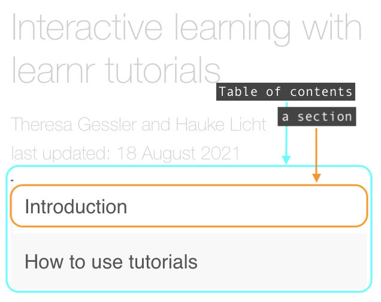
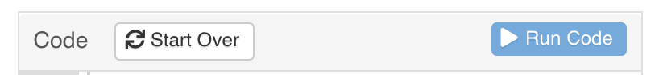

```{r knitr, include=FALSE}
knitr::opts_chunk$set(
  # code chunk options
  echo = TRUE

  , eval = TRUE
  , warning = FALSE
  , message = FALSE
  , cached = FALSE
  , exercise = TRUE
  , exercise.completion	= TRUE
  # figs
  , fig.align = "center"
  , fig.height = 4
  , fig.width = 5.5
  # , out.width = '50%'
)
```

```{r setup, include=FALSE}
library(learnr)
```

## Introduction

Welcome to web scraping with `learn2scrape`!
This R package offers an interactive way to learn web scraping in R by providing several self-contained tutorials.
While these tutorials are designed to accompany our *Automated Web data extraction* course, 
you can also work through them on your own.

You can view all tutorials contained in the `learn2scrape` package by running the following code in your R console:

```{r list-tutorials, exercise.lines = 1}
learnr::available_tutorials(package = "learn2scrape")
```

<!-- If you have any feedback, let me know in the next days [or after the course via e-mail](mailto:gessler@ipz.uzh.ch)! -->
<!-- Also, if you are interested in scraping, feel free to [watch the repository on Github](https://github.com/theresagessler/learn2scrape) to get updates on new elements. -->

## How to use tutorials

Each tutorial is a notebook with several sections.

### Navigating

You can *navigate* through sections by clicking on items in the table of contents menu on the left-hand side of the tutorial *or* by clicking on the "Next Topic" button located at the end of a section's (at the bottom of your tutorial viewer/browser tab).

```{r echo = FALSE, exercise = FALSE, fig.cap="*Fig 1* --- Tutorial menu"}

```

<br/>
*Click "Continue" to learn more*

### What's in a section 

Each tutorial section is usually a mix of text and code chunks.

- **_Text_** describes web scraping concepts, explains R code, or asks you to try out some code yourself.
- **_Code chunks_** show R code. They maybe maybe read-only or interactive.

You recognize interactive code chunks by top panel that includes a "Run Code" button.

```{r echo = FALSE, exercise = FALSE, fig.cap="*Fig 2* --- Interactive code chunk panel"}

```

<br/>

#### *Caution:* Beware of the "Start Over" button!

to the left of the "Run Code" button, there is a "Start Over" button.
Clicking on this will reset the code in a given code chunk.
So any changes you have made to the pre-defined R code will be lost if you click on this button!

This is even more important for the "Start Over" displayed in the left-hand tutorial panel below the table of content.
Clicking on this button will reset the code for *all* interactive code chunks included in the tutorial!
So all your work will be lost if you click on it.

### Interactive code chunks

The most important thing about tutorials, and what makes them interactive, is that *you can enter and run R code in interactive code chunks*.
So you cannot only execute the below code chunk interactively by clicking the "Run Code" button.
You can also alter the R code in any way you want!

**Try it yourself!** 
Replace the string `'Hello world!'` with some text of your choice and click "Run Code"

*Note:* When executing the code, the result is printed interactively below the code chunk. 
Text that reports results (i.e., evaluated code) begins with two hashtags `##`.


```{r interactive-example, exercise.eval = TRUE, exercise.lines = 2}
string <- 'Hello world!'
string
```

Compare this to the static (read-only) code chunk below.
This just prints the code and the result of evaluating it below.

```{r static-example, exercise=FALSE}
string <- 'Hello world!'
string
```

### Interactive code chunks are *forgetful*!

One important thing to know about **interactive code chunks** is that they **are independent** from one another.
So if you define an R objects or function in one code chunk, it *won't be available* in the following code chunks!

This is shown below. 
We first assign 1 to object `one`.

```{r defined, exercise.lines = 1}
one <- 1
```

If we now try to evaluate it in the next code chunk, an error is raised.

**Try it yourself!** Click "Run Code" to trigger the error message.

```{r forgotten, exercise.lines = 1}
one
```

This is the main difference of R tutorials to R Markdown documents or R scripts.
Therefore, you will usually need to repeat code from previous exercises.


### Viewing solutions

When we ask you to write some code on your own, we provide solutions.
You can view solutions by clicking on the link below an interactive code chunk.

In the below example, your task would be to find the remainder when 5 is divided by 2 (indicated by the "ToDo" comment).
The solution can be viewed below this code chunk.

```{r example-exercise}
# ToDo: find the remainder when 5 is divided by 2

```

<details>
<summary>**_Click here to view the solution!_**</summary>
```{r example-exercise-solution, exercise = FALSE}
# find the remainder when 5 is divided by 2
5 %% 2
```
</details>
