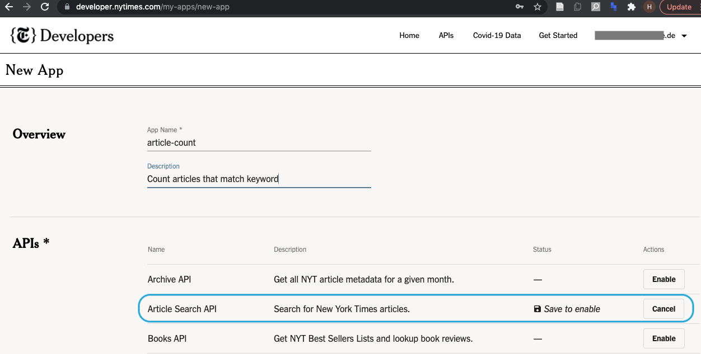
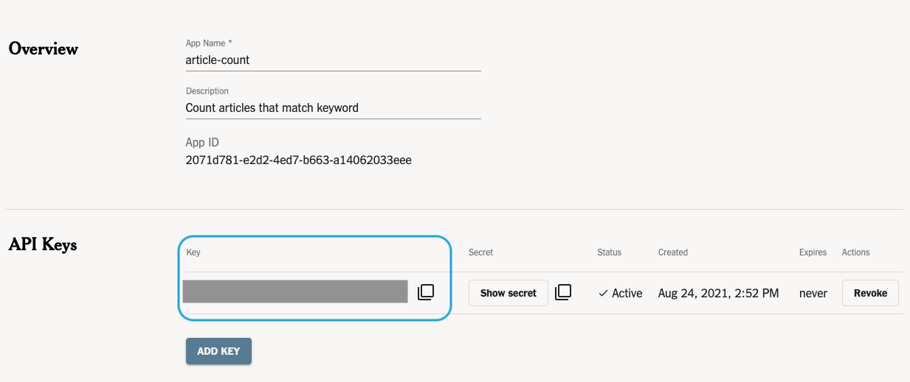

```{r knitr, include=FALSE}
knitr::opts_chunk$set(
  # code chunk options
  echo = TRUE
  , eval = TRUE
  , warning = FALSE
  , message = FALSE
  , cached = FALSE 
  , exercise = TRUE
  , exercise.completion = TRUE
  # figs
  , fig.align = "center"
  , fig.height = 4
  , fig.width = 5.5
  # , out.width = '50%'
)
```

## Introduction

In this tutorial, we'll take the New York Times (NYT) *Article Search* API as an example to learn more about how to work with APIs in R.
The NYT *Article Search* API allows users to search articles by key words, publish date (ranges), and many more parameters.

We will use it to return counts of articles and a short description of each article. 
This will also allow us to create a nice and simple graph for hits for certain keywords over time.

However, to request data, we need to register and authenticate.
Since is the case for most APIs the NYT *Article Search* API is a more realistic use case than the *Dad Jokes* API we've worked with in the previous API tutorial.

### R Setup 

We rely on the following packages:

```{r setup-invisible, exercise = FALSE, include = FALSE}
library(learnr)
library(learn2scrape)
```

```{r setup, exercise = FALSE}
library(httr)
library(ggplot2)
```

## Authentication

To be able to use the request data from the NYT Article search API, we first need to obtain API credentials. 

### Create developer account

You can obtain an API key for the NYT *Article Search* only if you have an active developer account.
So please first create a developer account at: https://developer.nytimes.com/accounts/create

### Create an App

Once you have created and verified your account, sign in at https://developer.nytimes.com/accounts/login. If you run this from within `learnr`, you can skip these steps.

To use the Article Search API, we next need to create an App:

1. go to https://developer.nytimes.com/my-apps
2. click "NEW APP" (top-right of window)
3. create an App (you can call your App however you want) and make sure to enable the *Article Search API*

```{r echo = FALSE, exercise = FALSE, fig.cap="*Fig 1* --- Create your App."}

```

### Obtain your API key

Lastly, you need to obtain the App's API key.
Copy the API key of your App to your clipboard ot save it in a text file.

```{r echo = FALSE, exercise = FALSE, fig.cap="*Fig 2* --- Obtain the API key."}

```


## Keyword-based search 

### Documentation

The first step when working with APIs is always to familiarize yourself with the documentation.
You can find the documentation [here](http://developer.nytimes.com/docs/read/article_search_api_v2).

In this tutorial, we will exclusively send GET requests to this API.
The parameters for get requests are documented [here](https://developer.nytimes.com/docs/articlesearch-product/1/routes/articlesearch.json/get)

### Endpoint

The next step is to identify the URL of the API endpoint want to use to request data from. 
In our case it is: http://api.nytimes.com/svc/search/v2/articlesearch.json

```{r search-endpoint, exercise = FALSE}
endpoint <- "http://api.nytimes.com/svc/search/v2/articlesearch.json"
```

### A first request

Now we can do a first API call using the `httr` package.

**Try it yourself**: Make a request to the article search endpoint to search fro articles containing the keyword 'democracy'

First set you API key: 
```{r api-key-invisible, exercise = FALSE, include = FALSE}
apikey <- 'b75da00e12d54774a2d362adddcc9bef'
```

```{r api-key, exercise.lines = 1}
apikey <- ''
```

Next, pass our keyword to the API's query parameter `q` and our API key to the parameter `api-key`, and send your request!

```{r keyword-search, exercise.setup = "api-key"}
params <- list(...)
resp <- GET(endpoint, query = params)
resp
```

```{r keyword-search-invisible, exercise = FALSE, include = FALSE}
params <- list(q = "democracy", "api-key" = apikey)
resp <- GET(endpoint, query = params)
```

Printing `resp`, we can see that the query was successful ('Status: 200').
Moreover, the field 'Content-Type' informs us that the return data is represented in JSON format.

### Parse the return data 

We can parse the returned data with `as = 'parsed'`.
This will convert the associated JSON data into an R list object.
We can assign the result to an object called 'dat' and inspect its structure.

```{r keyword-search-parse-as-json}
dat <- content(resp, 'parsed')
str(dat, 2) # list with 3 elements

dat$status # this should be "OK"
dat$response$meta # metadata
str(dat$response$docs, 1)
```

Alternatively, to extract the data in its original JSON format, you can call `content()` with `as = 'text'`. 
Looking at the first 100 characters, you'll see that the returned data comes in JSON format.

```{r keyword-search-parse-as-text, exercise.lines = 2}
txt <- content(resp, 'text', encoding = "UTF-8")
substr(txt, 1, 100)
```

## Filtering by publishing date 

If we check the API documentation, we find that we can subset by date with the `begin_date` and `end_date` parameters. 
Let's see how this works:

**Try it yourself!** 

1. Send a request to the NYT *Article Search* API, limiting the search to dates in the window 1 January to 31 December 2016.
2. Parse the response into an R list object.

```{r filtering-time, eval = FALSE}
params <- list(
  "q" = "democracy", 
  "api-key" = apikey, 
  # ToDo: complete the list of parameters
  ...
)
# ToDo: make an API request
resp <- ...
# ToDo: parse the response
dat <- ...
```

<details>
<summary>**_Click here to see an example solution!_**</summary>
```{r , exercise = FALSE}
params <- list(
  "q" = "democracy", 
  "api-key" = apikey, 
  "begin_date" = 20160101, 
  "end_date" = 20161231
)
resp <- GET(endpoint, query = params)
dat <- content(resp, 'parsed')
```
</details>
<br/>

Looking at the value recorded in `dat$response$meta$hits`, we learn that there were `r dat$response$meta$hits` articles published in the NYT between these two dates that contained the term "democracy." 

## Multiple API requests

Now imagine we want to look at the evolution of mentions of articles containing the term 'democracy' over time.

### Defining a function 

Following coding best practices, we want to write a function that 

- *takes* a keyword and a start and end dates as *arguments input*,
- and *returns* the counts of articles in this date range.

**Try it yourself!** Write this function!

```{r search-function, eval = FALSE}
#' @param q a character value used to search for matching articles 
#' @param since an integer/character values specifying the 'begin' date (format: 'YYYYmmdd')
#' @param until an integer/character values specifying the 'end' date (format: 'YYYYmmdd')
nyt_count <- function(q, since, until){
  
  # construct API query
  params <- list(
    # ToDo: add parameters
    ...
  )
  
  # query API
  resp <- GET(endpoint, query = params)
  
  # parse response
  dat <- content(resp, "parsed")
  
  # ToDO: return number of articles
  ...
}

# try it:
nyt_count(q = "democracy", since = 20160101, until = 20160131)
```

<details>
<summary>**_Click here to see an example solution!_**</summary>
```{r , exercise = FALSE}
nyt_count <- function(q, since, until){
  
  # construct API query
  params <- list(
    "q" = q,
    "api-key" = apikey,
    "begin_date" = since,
    "end_date" = until
  )
  
  # query API
  resp <- GET(endpoint, query = params, timeout(30))
  
  # parse response
  dat <- content(resp, "parsed")
  
  # return number of hits
  return(dat$response$meta$hits)
}
```
</details>
<br/>

### Iterating over years

But we want to get counts for individual years.
So we need to call our `nyt_count()` function multiple times with corresponding date windows, e.g.,

- ...
- 2018-01-01 -- 2018-12-31
- 2019-01-01 -- 2019-12-31
- 2020-01-01 -- 2020-12-31

We will write another function, `nyt_years_count()` that helps us do that.

**Try it yourself!** Please complete the code below to create our custom  `nyt_years_count()` function.

```{r yearwise-counts-function, eval = FALSE}
#' @param q a character value used to search for matching articles 
#' @param years an integer vector specifying years (e.g., `1990:1992`)
nyt_years_count <- function(q, years){
  
  # create vector recording year counts 
  # Hint: ideally, initialize with 0 or NAs
  out <- ...
  
  # iterate over years (values of integer sequence)
  for (year in years){
    
    # retrieve count (using your custom function)
    ... <- nyt_count(
        q = q
        , since = ...
        , until = ...
    )
    
    # pause some (milli)seconds
    Sys.sleep(runif(1, 0.5, 2))
  }
  
  return(out)
}

# test it
counts <- nyt_years_count(q = "democracy", years = 2010:2020)
counts
```

<details>
<summary>**_Click here to see an example solution!_**</summary>
```{r , exercise = FALSE}
nyt_years_count <- function(q, years){
  
  # initialize final counts vector with missings
  out <- setNames(rep(NA_integer_, length(years)), years)
  
  # iterate over years
  for (year in years){
    message(year)
    
    # retrieve count
    cnt <- nyt_count(
        q = q
        , since = as.integer(paste0(year, "0101"))
        , until = as.integer(paste0(year, "1231"))
    )

    # add year count (if not missing)
    if (!is.null(cnt)) {
      out[as.character(year)] <- cnt
    } else {
      # (if missing, raise warning and continute)
      warning(
        "could not retrieve count for year ", year, 
        call. = FALSE, 
        immediate. = TRUE
      )
    }
    
    # pause some (milli)seconds
    Sys.sleep(runif(1, 0.5, 2))
  }
  
  # return counts
  return(out)
}

# test it
counts <- nyt_years_count(q = "democracy", years = 2010:2020)
counts
```

</details>

<br/>

### Plotting the result

We will plot this to visualize the over-time development. Note that this will plot based on the data we downloaded, in case you've changed the keywords

```{r plot-year-counts}
# use pre-downloaded data
counts <- learn2scrape::nyt_year_counts

# plot

```


<details>
<summary>**_Example Solution (click)_**</summary>
```{r , exercise = FALSE}
# use pre-downloaded data
counts <- learn2scrape::nyt_year_counts

ggplot(
  data = data.frame(
    year = as.integer(names(counts)), 
    count = counts
  ),
  mapping = aes(x = year, y = count)
) +
  geom_point() + 
  geom_smooth() + 
  labs(
    title = "Mentions of democracy on the NYT, by year",
    x = "Year", 
    y = "Article Count"
  )

```

</details>

<br/>

### More improvements 

We will not discuss this in detail, but you could try to generalize the function even more so that it works with any date interval, not just years:

```{r, exercise = FALSE}
nyt_dates_count <- function(q, init, end, by){
  # sequence of dates to loop over
  dates <- seq(from = init, to = end, by = by)
  counts <- rep(NA, length(dates)-1)
  
  # loop over dates (but the last)
  for (i in 1:(length(dates)-1)) {
    
    # information message to track progress
    message(dates[i])
  
  
    # retrieve count
    counts[i] <- nyt_count(
      q = q, 
      # changing format to match NYT API format
      since = format(dates[i], "%Y%m%d"),
      until = format(dates[i+1]-1, "%Y%m%d"),
    )
  }
  
  # # improving this as well so that it returns a data frame
  # df <- data.frame(date = as.Date(dates[-length(dates)], format="%Y%m%d"), count = counts)
  return(counts)
}
```

