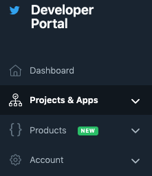
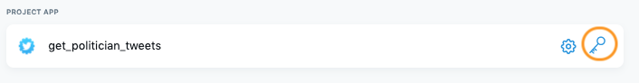
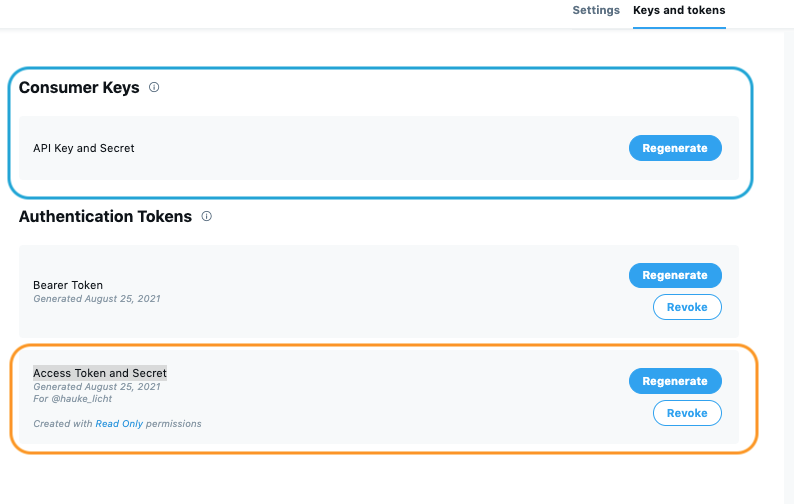

```{r knitr, include=FALSE}
knitr::opts_chunk$set(
  # code chunk options
  echo = TRUE
  , eval = TRUE
  , warning = FALSE
  , message = FALSE
  , cached = FALSE 
  # figs
  , fig.align = "center"
  , fig.height = 4
  , fig.width = 5.5
)
```


```{r setup-invisble, include = FALSE}
library(learnr)
```


## Introduction

In this tutorial, we will go through the steps required to 

1. create a Twitter developer account, 
2. obtain Twitter API credentials, and
3. use these credentials in R with the `rtweet` package.

## Applying for a developer account 

To apply for a developer account, you need to have an active Twitter account.
You can create one at https://twitter.com/i/flow/signup

Next, you can then apply for a developer account at https://developer.twitter.com/en/apply-for-access
Note that while applying you need to specify what you intended to use the API and Twitter data for  (your "use case"). 
Specifically, Twitter states on its [*developer platform*](https://developer.twitter.com/en/docs/developer-portal/overview)

> When applying, you will have to submit detailed use case information about your intended use of Twitter APIs. 
> To get through the application process as quickly as possible, please make sure to be specific about what you are building.

Most use cases for political science research will follow the scheme "collecting [data] from accounts of [actors] to study [behavior]."
But you should make sure to provide more detail than that:

- Do you want to obtain information (tweets, followers, etc.) for a pre-defined list of accounts or rather use other sampling methods?
- How frequently do you want to send API requests?
- When will you query data the first time? When the last time? (time interval) 

If you have have some idea how to answer these questions,  you can click on the "Apply for a developer account" button and follow the instructions.

```{r echo = FALSE, exercise = FALSE, fig.cap="*Fig 1* -- Page to apply for a Twitter developer account"}

```

## Creating a Project/App

Once your application has been confirmed,
you can create new Apps and projects in the *developer portal* dashboard at https://developer.twitter.com/en/portal/dashboard

On the left of this dashboard, in the menu, you can select your Projects and Apps

```{r echo = FALSE, exercise = FALSE, fig.cap="*Fig 2* -- Developer Portal menu"}

```


If you click on ["Projects & Apps"](https://developer.twitter.com/en/portal/projects-and-apps) and navigate to "Overview", you'll see an overview of all your projects and App (if any).
For example, you should see the one you have specified when applying for your developer account.

## Obtaining API keys

You can obtain API keys for every active App listed in your Developer Portal.

### Navigate to your App

To obtain these keys, click on the &#128273; (key) symbol to the right of the name of your App (encircled in orange in Figure 3).

```{r echo = FALSE, fig.cap='*Fig 3* -- "Keys and Secrets" button of a Twitter App'}

```

You should be directed to a page that looks like the screenshot shown in Figure 4.

```{r echo = FALSE, fig.cap="*Fig 4* -- *Keys and Secrets* page of a Twitter App"}

```

### Save your credentials to your computer

Now we are ready to obtain your credentials.
To allow you to reuse them in different R programs, we want to save them on your computer.
So you first need **create an empty JSON file** with the following structure in the text editor of your choice.

```json
{
  "app": "",
  "consumer_key": "",
  "consumer_secret": "",
  "access_token": "",
  "access_secret": ""
}
```

In this JSON file, 

1. insert your App name in the "app" field.
2. in the *Consumer Keys* section (encircled blue in Figure 4), click "Generate" (or "Regenerate") 
and copy-paste your *API Key* and *API Secret Key* to the "consumer_key" respectively "consumer_secret" fields of the JSON file
3. in the *Access Token and Secret* section (encircled orange in Figure 4), click "Generate" (or "Regenerate") and copy-paste your *Access Token* and *Access Token Secret* to the "access_token" respectively "access_secret" fields of the JSON file.

Once you've entered all this information, you can save the JSON file to your computer.
Make sure to follow the instructions for securely handling API credentials provided [here](https://developer.twitter.com/en/docs/basics/authentication/guides/securing-keys-and-tokens) and [here](https://cran.r-project.org/web/packages/httr/vignettes/secrets.html).

## Using your API credentials in R 

With the following R code, you can then always read the API credentials and create an rtweet 'token' object from them: 

```{r eval = FALSE}
library(jsonlite)
library(rtweet)

# specify the path to your Twitter API secrets JSON
secrets_file <- file.path(...)

# read credentials from packaged JSON file
credentials <- fromJSON(creds_fp)

# create rtweet 'token' object
token <- do.call(create_token, credentials)
```

If you are interested in a more detailed explanation, check `vignette("auth", package = "rtweet")`

### Does it work?

To check that your token works, try running some `rtweet` code, for example:

```{r eval = FALSE}
lookup_users("th_ges")[["name"]]
```

If it doesn't work, double-check that you correctly copy-pasted your consumer and token keys and secrets into the JSON file.
To make 100% sure, you can also regenerate them at and try again.
