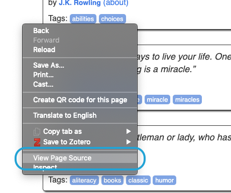
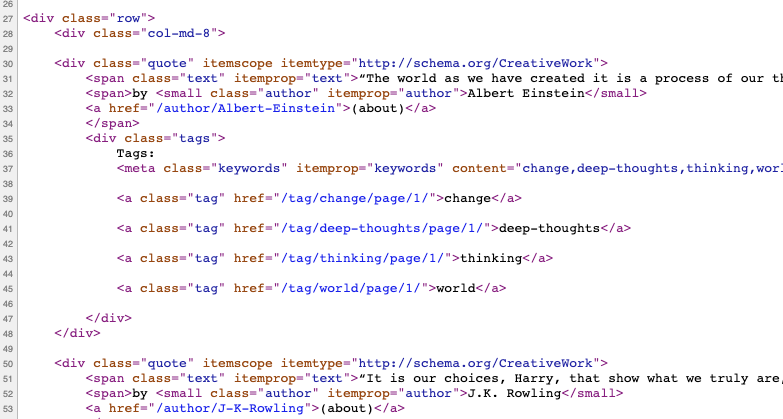
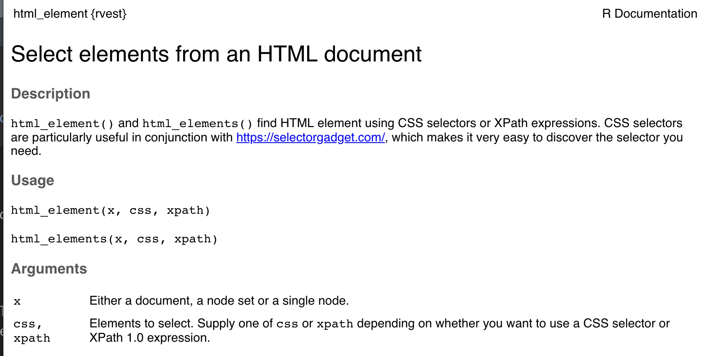

```{r knitr, include=FALSE}
knitr::opts_chunk$set(
  # code chunk options
  echo = TRUE
  , eval = TRUE
  , warning = FALSE
  , message = FALSE
  , cached = FALSE 
  , exercise = TRUE
  , exercise.completion = TRUE
  # figs
  , fig.align = "center"
  , fig.height = 4
  , fig.width = 5.5
  , out.width = '50%'
)
```

```{r setup-invisble, exercise = FALSE, include = FALSE}
library(learnr)
library(learn2scrape)
library(rvest)

page <- system.file("extdata", "quotepage.html", package = "learn2scrape")
```


## Introduction

In this tutorial, you'll learn how to extract data from HTML files with the `rvest` R package. 

### R setup

We use just the `rvest` package in this tutorial:

```{r setup, exercise = FALSE}
library(rvest)
```


## A simple webpage

Imagine, you want to extract information from (i.e., "scrape") a simple webpage.
For example [http://quotes.toscrape.com/](http://quotes.toscrape.com/){target="_blank"}, a webpage full of quotes.

### Plan of attack

Here is what you need to do:

1. Specify the page address (URL)
2. read and "parse" the HTML from that address

**Try it yourself!**
Please first assign the page URL http://quotes.toscrape.com/ to an object called 'url.'
Next, use the `read_html()` function to read and parse this page.

```{r read-html, exercise.lines = 3}
# To Do: read the HTML code of this URL
"http://quotes.toscrape.com/"
```

<details>
<summary>**_Click here to see the solution!_**</summary>

```{r page-setup, exercise = FALSE}
# read the HTML code of this URL
page <- read_html("http://quotes.toscrape.com/")
```
</details>

### HTML source code in R 

The R object that is created by calling `read_html()` may not look very similar to the webpage itself
This is because we extract only the HTML code of this page.
HTML is there for organizing web data (i.e., content), not how this data is dispayed (i.e., style).

If you instead look at the **source code** of the webpage, you'll see that we exactly got this information when calling `read_html()`.
Depending on the browser you are using, you can probably select 'view source' after a right-clicking the page (see Figure 1)

```{r echo = FALSE, exercise = FALSE, fig.cap="*Fig 1* --- How to view page source code of quotes.toscrape.com in Google Chrome"}

```

What you then see should look similar to the screenshot shown in Figure 2.

```{r echo = FALSE, exercise = FALSE, fig.cap="*Fig 2* --- Screenshot of source code of quotes.toscrape.com"}

```


*Note:* If you have trouble, [google has an up-to-date explanation](https://www.google.com/search?hl=&site=&q=how+to+view+webpage+source+code+in+browser){target="_blank"}. 


## Extracting specific elements

The `html_elements()` function allows us to select specific elements from the HTML code. 
Please have a look at the documentation of the `?html_elements()` function (see Figure 3).


```{r echo = FALSE, exercise = FALSE, fig.cap="*Fig 3* --- R documentation of `html_elements()`"}

```

The documentation tells us that we need to specify either an *Xpath* or a *CSS selector*. 
If you have not used HTML before, this might sound complicated. 

### HTML Basics

It helps to get a bit into the structure of HTML. 
In a nutshell, HTML is a language for organizing webpage content. 
Please click on [this link](https://www.w3schools.com/html/default.asp){target="_blank"} for details.

### Tags 

**tags** are the most fundamental building blocks of HTML code.
The HTML code chunk below illustrates this:

```html
<div>
  <p>Hello!</p>
  <p>Goodbye!</p>
</div>
```

There are two types of **tags** in this code example: 

- '**div**' (division) and 
- '**p**' (paragraph) tags.

The code is organizing them so that the two `p` elements are "nested" in the outer  `div` element.
This is indicated by opening and closing tags: 

- **opening tags** start with a left angle bracket ("<") followed by the *tag name* (e.g., 'div')
- **closing tags** start with a left angle bracket followed by a *slash* ("</") and only then the *tag name* (e.g., 'div')

This why we said the  `dic` element nests the two `p` elements:
The `div` element ends only after the two `p` elements.

### Attributes 

In addition to a tags, most web elements have **attributes** associated with them.
As shown below, attributes are written in `key='value'`-notation inside the leading and trailing '<' and '>' symbols of opening tags.

```html
<tag attribute1='a' attribute2='b'>
```

The most common attribute is the 'class' attribute. 
Classes help developers to differentiate between web elements of the same tag type.
So, for example, one 'div' element can have the class 'main', and another 'div' element the class 'extra.'

Other common attributes are 'id' (identifier) and 'href' (hyper references).
More on this later.

### CSS selectors 

CSS selectors are a type of *grammar* or *pattern description* that helps us select specific elements from HTML code. 
<!-- For example, the CSS selector to refer to elements -->

<!-- - of a specific tag type (e.g., 'p') `x` is just 'x -->
<!-- - of a certain class `x` is '**.**x' -->
<!-- - with a certain ID `x` is '**#**x' -->

For this lesson, we will focus on two of the most important selector: *tag name* and *class* selectors.

#### *Selecting by tag name*

To select elements of a specific *tag* type, just pass its name to the `css` argument of the `html_elements()` function (without the leading and trailing '<' and '>').
The CSS selector will select all elements with that tag name.

**Try it yourself!** 
<!-- out with some of the HTML tags that we learned on the course slides.**  -->
Select all 'a' (anchor) tags
<!-- As I said, we will focus more on gathering specific information but if you just want to parse large amounts of data, the universal selector can be very useful. Now, let's practice! -->

```{r select-tag}
url <- "http://quotes.toscrape.com/"
page <- read_html(url)
# To Do: select all 'a' tags using CSS selectors
html_elements(page, css = ...)
```

#### *Selecting by class*

To select elements with a specific **class**, just pass the class name to the `css` argument of the `html_elements()` function with a '.' (full stop) in front.

**Try it out yourself!**
<!-- with some of the class you have spotted when inspecting the source code of the quotes webpage.**  -->
Select all HTML elements with class 'quote'.

```{r select-class,}
url <- "http://quotes.toscrape.com/"
page <- read_html(url)
# To Do: select elements with class 'quote'
html_elements(page, css = ...)
```

#### *Further reading*

For a list of CSS selectors, check out [this collection](https://www.w3schools.com/cssref/css_selectors.asp){target="_blank"}. 
If you want to practice CSS Selectors in a fun way, I recommend playing with the [CSS Diner](https://flukeout.github.io/){target="_blank"} where you can learn about different selector structures.

### Extracting all vs. just one web element

You will have noticed that `html_elements()` returns *all* elements that match your query.
To just return the first matching element, use `html_element()` (singular!). 

## Tools to find the right selectors

While understanding HTML helps, we often do not need to engage with the code because there are lots of tools to help us. 

### Using *SelectorGadget*

For example, *SelectorGadget* is a JavaScript tool that allows you to interactively figure out what CSS selector you need to extract parts of a webpage. 
If you have not heard of *SelectorGadget*, visit [this webpage](https://selectorgadget.com/){target="_blank"} or watch this introduction video:


### Try it yourself

We will try to use SelectorGadget now. 
If you are browsing with Google Chrome, you can [install SelectorGadget](https://chrome.google.com/webstore/detail/selectorgadget/mhjhnkcfbdhnjickkkdbjoemdmbfginb) as an extension.
If you have a different browser, drag this link into your [bookmark bar and click on it when needed](javascript:(function(){var%20s=document.createElement('div');s.innerHTML='Loading...';s.style.color='black';s.style.padding='20px';s.style.position='fixed';s.style.zIndex='9999';s.style.fontSize='3.0em';s.style.border='2px%20solid%20black';s.style.right='40px';s.style.top='40px';s.setAttribute('class','selector_gadget_loading');s.style.background='white';document.body.appendChild(s);s=document.createElement('script');s.setAttribute('type','text/javascript');s.setAttribute('src','https://dv0akt2986vzh.cloudfront.net/unstable/lib/selectorgadget.js');document.body.appendChild(s);})();).

**Try it yourself!** Use *SelectorGadget* to select the text of all quotes on the quotes webpage.

1. Click on the element you want to select. *SelectorGadget* will make a first guess at what CSS selector you want and mark all similar elements. It's likely to be a bad guess since it only has one example to learn from, but it's a start. Elements that match the selector will be highlighted in yellow.
2. Click on elements that shouldn't be selected. They will turn red. Click on elements that *should* be selected but are not so far. They will turn green.
3. Iterate until only the elements you want are selected. 

Of course, *SelectorGadget* is not perfect and sometimes will not be able to find a useful CSS selector. Sometimes starting from a different element helps.

```{r selector-quiz, exercise = FALSE, echo = FALSE}
quiz(
  caption = "Quiz about CSS selectors",
  question(
    paste(
      "Try finding the CSS selector for the text of the quote, without author and tags.",
      "What is the selector you receive?"
      ) ,
    answer(".quote", message = "Almost but we did not want to include the author and tags!"), 
    answer(".tags .tag"),
    answer(".text", correct = TRUE),
    answer("h2"),
    allow_retry = TRUE
  )
  # ,
  # question("Try finding the CSS selector for all tags associated with each quote. Deselect the Top Ten tags on the side. What is the selector you receive?",
  #   answer(".quote"),
  #   answer(".tags .tag", correct = TRUE),
  #   answer(".text"),
  #   answer("h2"),
  #   allow_retry=TRUE
  # )
)
```


### Applying CSS Selectors

Now, we try to use this CSS selector with the `html_elements()` function. 
Since each exercise chunk is independent, there will be a bit of repetition involved but it aids the memory: Parse the page, use the CSS selector to select only the quotes from the parsed HTML and assign them to a new object called 'selected_nodes'. 
Then, inspect the results by calling the object using `str()`!


```{r select-text-nodes, exercise.setup="page-setup"}
# To Do: extract all elements from the quotes webpage
#        that match the '.text' CSS selector
```

This already looks more structured! 
But we should get rid of the HTML tags.

This is what we deal with next.

## Extracting text

The function `read_html()` parses the HTML code, similar to what your browser does. 
Still, it gives us the entire source code including all HTML elements and their attributes. 

For now, we are only interested in the text of this webpage.
We can use the function `html_text()`.

**Try it yourself!**

1. assign the parsed page to an object called 'page' 
2. call `html_text()` on 'page' and assign the result to an object called 'page_text' (*hint:* set argument `strip = TRUE`)
3. print the fist six lines of extracted text (*hint:* try to use `cat()` isntead of `print()`)

```{r extract-text}
url <- "http://quotes.toscrape.com/"

# To Do: write the result of the below line to an object called 'page'
read_html(url)

# To Do: extract the HTML text from 'page'

# To Do: print the fist six lines of extracted text 
```


Admittedly, this still looks very messy. 
Maybe you are thinking: If only there was a way to tell R to just get the text of the quotes!
Luckily, this is just what we've learned above.

**Try it yourself!**

1. From the quotes webpage, extract all elements with class 'text'.
2. Extract their text.

```{r select-text-nodes-texts,  exercise.setup='page-setup'}
# To Do: extract all elements with class 'text'

# To Do: extract the text of these elements
```

