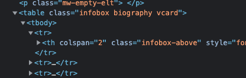

```{r knitr, include=FALSE}
knitr::opts_chunk$set(
  # code chunk options
  echo = TRUE
  , eval = TRUE
  , warning = FALSE
  , message = FALSE
  , cached = FALSE 
  , exercise = TRUE
  , exercsie.completion = TRUE
  # figs
  , fig.align = "center"
  , fig.height = 4
  , fig.width = 5.5
  , out.width = '50%'
)
```


```{r setup-invisible, exercise = FALSE, include = FALSE}
library(learnr)
```


## Introduction

<!-- In tutorial "201-rvest-introduction", you have learned how to use some of the basic functions of the `rvest` package: `read_html()`, `html_elements()` and `html_text()`. -->

A lot of data analysis methods rely in tables as primary data format.
Tables allow to record observations in rows and their attributes in columns.
Hence, it is particular the data displayed in HTML tables we are interested in when considering to scrape some website.

In R, the most used tabular data format is the 'data.frame'. 
So our goal when web scraping HTML tables is usually to extract their data into R data frames.
This is what  `rvest::html_table()` does and you will learn in this tutorial how use it to extract data from HTML tables.


```{r setup, exercise = FALSE}
library(rvest)
```

## The anatomy of a HTML table

A table is a two-dimensional data format with rows and columns.
Table rows correspond to observations, columns to attributes. 
HTML tables implement this logic.

### HTML recap 

You have learned previously that

- HTML is a language to organize web data
- the basic building blogs of HTML code are web elements
- that web elements differ with regard to their *tag* type (e.g., 'div', 'p', 'a', etc.)

### HTML table building blocks

A HTML table is made up of four different types of web elements:

- an 'table' element,
- 'tr' (*table row*) elements,
- 'th' (*table header*) elements, and
- 'tr' (*table row*) elements

#### *The 'table' element*

The 'table' element nests the other three elements.
(It is the parent element.)
So you recognize a table by the openeing (and closng 'table' tag):

```html
<table>
  <!-- ... table content ... -->
</table>
```

#### *Table row elements*

Table row ('tr') elements represent data for individual observations *or* header information.
The are the direct descendants (children) of the outer 'table' element.

```html
<table>
  <tr> <!-- ... data of first row ... --> </tr>
  <!-- ... more rows ... -->
</table>
```

#### *Table header elements*

To know what data is recorded in a table, we need to know what attributes a table's columns record.
This is the purpose of *table header* ('th') elements.
Put more simply,  *table header* ('th') elements specify the **names** of table columns.

So the below example table has two columns.
The first column records the 'Name' attribute/is named 'Name', and
the second column records the 'Age' attribute/is named 'Age'.

```html
<table>
  <tr>
    <th>Name</th>
    <th>Age</th>
  </tr>
  <!-- ... more rows ... -->
</table>
```

#### *Table data elements*

While the table header indicates *what* data is recorded in a HTML table,
table data ('td') elements are there to record actual data.
They represent the cells of a table and are nested by table row elements:

```html
<table>
  <!-- ... header ... -->
  <tr>
    <th>Name</th>
    <th>Age</th>
  </tr>
  <!-- ... data ... -->
  <tr>
    <td>Sarah</td>
    <td>12</td>
  </tr>
</table>
```

## Reading HTML tables into R

Given the anatomy of a HTML table, what we need to do to represent a HTML table's data as a data frame in R is 

1. to locate the outer 'table' element
2. read the header information (if any) from the table row element ('tr') that nests table header elements ('th')
3. read data from all table row element ('tr') that nest table data/cell elements ('td')
4. assign table data to the rows of a data frame, and name its columns according to the table headers

This sound complicated, right!?
Fortunately, there is a function in the `rvest` package that does just that: `html_table()`

### The `html_table()` function

Like other `rvest` functions, the `html_table()` takes as first argument a parsed HTML page object, a list of web elements, or a single table web element as input (more on the differences below!). 

The second most important parameter of `html_table()` is `fill`. 
If you specify `fill = TRUE`, `html_table()` will automatically fill rows with fewer than the maximum number of columns with `NA`s. 
This is useful because tables on the internet are often messy - they have inconsistent numbers of cells per row or the format is otherwise messed up. 
The `fill` parameter allows you to deal with this by filling in `NA` values where necessary.

### Extracting a table

Let's use `html_table()` to extract a table from [Wikipedia's list of the tallest buildings](https://en.wikipedia.org/wiki/List_of_tallest_buildings){target="_blank"}.

**Try it yourself!**
Go to https://en.wikipedia.org/wiki/List_of_tallest_buildings
Extract the table element located at Xpath '//table[2]'.
Convert it to an R data frame using `html_table()`.

```{r one-table}
url <- "https://en.wikipedia.org/wiki/List_of_tallest_buildings"
# To Do: read and parse the HTML code from `url`
page <- ...

# To Do: extract the table element at Xpath '//table[2]'
# hint: there is a 'singular' equivalent to `html_elements()`
table_element <- ... 

# To Do: convert this table's data into an data frame
table_df <- ...
```

<details>
<summary>**_Example Solution_**</summary>
```{r one-table-solution}
url <- "https://en.wikipedia.org/wiki/List_of_tallest_buildings"

# read and parse the HTML code from `url`
page <- read_html(url)

# To Do: extract the first 'table' web element
table_element <- html_element(page, xpath = "//table[2]")

# To Do: convert this table's data into an data frame
table_df <- html_table(table_element)
```
</details>
<br/>

*Note*: Wonder why we use Xpath? Well, just try to use CSS 'to look for the to extract a table with `html_element()`. What you get is the first table element on the webpage, which is just a table legend.

## Extracting one vs. many tables

`html_table()` actually behaves differently depending on what you input.

### One table element in, one data frame out

If you input `html_table()` a 'html_node' object that represents a 'table' element, it extracts data from this table and returns these data as a 'data.frame' object.
This is the behavior you've relied on the the previous example
(You can verify above that `html_name(table_element)` returns 'table' and that `is.data.frame(table_df)` is true.)

### Many table elements in, list of many data frames out

If instead you input `html_table()` a 'html_nodeset' object that represents *many* 'table' elements, (a) for each table, it extracts the data and converts it to an R 'data.frame' object, and
(b) all table data frames are then returned in a list of data frames.

This is what you get when you first extract all tables from a web page (by calling `html_elements(page, 'table')`) and then pass the resulting object to `html_table()`.

**Try it yourself!**
Go to https://en.wikipedia.org/wiki/List_of_tallest_buildings
Extract *all* table elements.
Call `html_table()` on the resulting object.
Verify that this returns a list of data frames!

```{r many-tables}
url <- "https://en.wikipedia.org/wiki/List_of_tallest_buildings"
page <- read_html(url)

# To Do: extract all table elements
table_elements <- ...

# To Do: extract tables' data into a list of data frame
list_of_table_dfs <- ...

# To Do: verify that `list_of_table_dfs` is a list

# To Do: verify that all elements of `list_of_table_dfs` are 'data.frame' objects
```

<details>
<summary>**_Example Solution_**</summary>
```{r many-tables-solution}
url <- "https://en.wikipedia.org/wiki/List_of_tallest_buildings"
page <- read_html(url)

# extract all table elements
table_elements <- html_elements(page, 'table')

# extract tables' data into a list of data frame
list_of_table_dfs <- html_table(table_elements)

# verify that `list_of_table_dfs` is a list
is.list(list_of_table_dfs)

# verify that all elements of `list_of_table_dfs` are 'data.frame' objects
all(purrr::map_lgl(list_of_table_dfs, is.data.frame))
```
</details>

### HTML document in, list of tables' as data frames out (if any)

`html_table()` moreover allows you to extract all tables from a HTML document.
You just pass the object returned by `read_html()` (in our code this always was called 'page'),
`html_table()` will return a list of data frames recording the data of *all* tables on this page.

So you can basically skip the `table_elements <- html_elements(page, 'table')` step above if you really want to extract all tables from a web page

*Note*: The same applies to any list of web elements (i.e., 'html_nodeset' object). If you not specifically extract one or more table web elements from it, `html_table()` will return a list of data frames recording the data of *all* tables that are nested in the (list) of web element(s).

### Comparing behaviors

To sum up, what type of data `html_table()` returns depends on what you input:

- If you pass a single 'table' element (e.g., by extracting the first 'table' web element from a page), the result will be a *data frame*.
- If instead you pass a parsed HTML page or list of HTML elements to extract all tables from the input, `html_table()` will return a *list of data frames*.

**Try it yourself**: Use `str(..., 1)` to compare how `html_table()` behaves depending on the input type: 

```{r one-vs-many-tables}
urls <- "https://en.wikipedia.org/wiki/List_of_tallest_buildings"
page <- read_html(urls)

# 1. Behavior if input object is a 'xml_document'
class(page)
# ToDo: extract all tables from `page`
a <- ...
# ToDo: inspect how the return object is structured
str(a, 1)

# 2. Behavior if input is a 'xml_nodeset' object (list of table web elements)
# ToDo: extract all table web element from `page`
table_elements <- ...
# To Do: what's the class of this object?
class(table_elements) 
# extract tables 
b <- html_table(table_elements)
# ToDo: inspect how the return object is structured
str(b, 1) 

# 3. Behavior if input is a 'xml_node' object representing a single table element
# ToDo: extract the first table from `page`
first_table <- ... 
# check: what's the class of this object?
class(first_table) 
# extract table
c <- html_table(first_table)
# ToDo: inspect how the return object is structured
str(c, 1) 

```

## Selecting specific tables

The different behaviors of `html_table()` are useful because they allow you to extract specific tables from a webpage.

### Using integer indexing

If you know where the table is located (i.e., is it he first, second, or last table, etc.), you can first extract all tables from the table and then use using `[[` to extract the corresponding data frame from the returned list of data frames:

<!-- Alternatively, you want to proceed in a piping-chain, you can use the command `extract2()`, adding the number of the table in brackets (the command name is no typo - `extract` without the 2 works for vectors, `extract2()` works for lists). -->

**Try it yourself!** 
Extract the second table from the Wikipedia list of tallest buildings.

```{r extract-second-table}
urls <- "https://en.wikipedia.org/wiki/List_of_tallest_buildings"
page <- read_html(urls)
all_table_dfs <- html_table(page)
# ToDo: extract the second table
second_table <- ...
```

### CSS selector and XPath solutions

The integer indexing method is limiting because in many use cases you may not know in what absolute position the table you are interested is is located on the page.
Suppose, for example, that you are scraping Wikipedia articles about artists or writers.
Each article contains a list of their work.
But each article may contain a variety of other tables.
So the table listing a writer/artist's work may be in different locations depending on the page.

In these case, you know which table to extract but you need to find another way of unambigously locating them on differnt pages.
This is where CSS selectors or Xpath are particulary useful!
<!-- More Generally determining which table to extract upfront is useful when you scrape different pages that all contain the relevant information in a table but the corresponding tables are in different places on different pages. -->

In our example, you could use `html_element()` to extract the relevant table from each writer/artist's page *if* these tables share a common CSS selector or Xpath across pages.

### An example

Let's try this out!
Look at the [Wikipedia list of the cast of *Wine Country*](https://en.wikipedia.org/wiki/Wine_Country_(film)#Cast).

For each actor listed in the "Cast" section, we want to extract the info box from their Wikipedia pages
This is the framed box on the right hand side of articles, shown in Figure 1 for [Amy Poehler's Wikipedia article](https://en.wikipedia.org/wiki/Amy_Poehler).

```{r echo = FALSE, exercise = FALSE, fig.cap="*Fig 1* --- Info box of Amy Poehler's Wikipedia article"}

```

If you inspect the source code of this info box, you'll notice that it is a HTML table (see Figure 2).

```{r echo = FALSE, exercise = FALSE, fig.cap="*Fig 2* --- HTML code of Wikipedia info box"}

```

If you carefully inspect the source code, you will also notice that there is one piece of information that allows us to extract info box tables reliably across pages.
Which information is this?

```{r selector-quiz, exercise = FALSE, echo = FALSE}
quiz(
  caption = NULL,
  question(
    "What information that allows us to extract info box tables reliably across pages?",
    answer("it's always the first table element on a page", message = "May be -- but maybe not"), 
    answer("they all have class 'infobox'", correct = TRUE),
    answer("they are all 'infobox' elements"),
    allow_retry = TRUE
  )
)
```

### Plan of attack

So what we need to do is 

1. extract the links to the cast members Wikipedia articles'
2. extract the info box table data from each

### Code

**Try it yourself!**

1. Use *SelectorGadget* to select all the links to the cast members from the movie page (see https://en.wikipedia.org/wiki/Wine_Country_(film)#Cast)
2. extract the links to their pages using *SelectorGadget* and create an R character vector `urls` from them
3. use a `for`-loop to extract the info box data from each page and write them all to a list object called 'info_boxes'

**Caution:** Be polite and don't forget to pause between iterations!

<!-- *Unfortunately, the page changed since the creation of this tutorial. Please only scrape the first 10 URLs, otherwise you will run into an error!* -->

```{r wine}
cast_links <- ...

# ToDo: create a list that collects all extracted tables
... <- ...

# ToDo: loop over elements in vector `cast_links` (see line 1)
for (...) {
  
  #ToDo: read and HTML from page link 
  ... 
  #ToDo: extract all tables from 
  ... 
  
  # pause between 2 and 3 seconds
  Sys.sleep(runif(1, 2, 3))
}
```

<details>
<summary>**_Example Soluion_**</summary>
```{r wine-solution, exercise = FALSE, eval = FALSE}
cast_links <- c(
  "/wiki/Amy_Poehler",      "/wiki/Rachel_Dratch",    "/wiki/Ana_Gasteyer",     
  "/wiki/Maya_Rudolph",     "/wiki/Paula_Pell",       "/wiki/Emily_Spivey",     
  "/wiki/Tina_Fey",         "/wiki/Maya_Erskine",     "/wiki/Jason_Schwartzman",
  "/wiki/Cherry_Jones",     "/wiki/Jay_Larson",       "/wiki/Liz_Cackowski",    
  "/wiki/Sunita_Mani",      "/wiki/Greg_Poehler",     "/wiki/Bren%C3%A9_Brown"
)
cast_links <- paste0("https://en.wikipedia.org", cast_links)

# create list for collecting extracted tables
info_boxes <- list()

# loop over article URLs
for (link in cast_links) {
  message("iteration ", length(tables))
  # read page and parse HTML
  page <- read_html(link)
  # extract tables from page
  info_boxes[[link]] <- html_table(page)
  # pause
  Sys.sleep(2)
}

# how many tables extracted?
lengths(info_boxes)
```
</details>

### Conclusion

You will see that all tables are quite heterogeneous --- so this is not a general-purpose solution. 
Still, when you are dealing with election results or similar data, scraping tables based on their nodes can be incredibly helpful!

### Some advanced stuff

You'll have noticed that we have asked you to manually extract links to actors' Wikipedia pages in step 2 above.
Could you think about a way to automate this?

Try to put in words what you'd need to do to extract this information, say, from 100 pages of similarly structured articles about movies and their casts on Wikipedia.

**Hint:** Solving this problem is challenging! 
As shown below, you'll need to rely on Xpath and use nesting predicates and axes syntax (see https://devhints.io/xpath).
We will pick up this challenge when speaking more about Xpath!

<details>
<summary>**_Example Solution_**</summary>
```{r , exercise = FALSE, eval = FALSE}
url <- "https://en.wikipedia.org/wiki/Wine_Country_(film)"
page <- read_html(url)

cast_list <- html_element(page, xpath = "//h2[./span[@id='Cast']]/following-sibling::ul")

casts_rel_links <- cast_list %>% 
  html_elements("a") %>% 
  html_attr("href")
```
</details>
