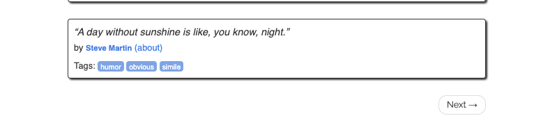

```{r knitr, include=FALSE}
knitr::opts_chunk$set(
  # code chunk options
  echo = TRUE
  , eval = TRUE 
  , warning = FALSE
  , message = FALSE
  , cached = FALSE 
  , exercise = TRUE
  # figs
  , fig.align = "center"
  , fig.height = 4
  , fig.width = 5.5
  , out.width = '50%'
)
```


```{r setup-invisible, exercise = FALSE, include = FALSE}
library(learnr)
library(learn2scrape)
library(rvest)
page <- read_html(system.file("extdata", "quotepage.html", package = "learn2scrape"))
```


## Introduction

In tutorial "201-rvest-introduction", you have learned how to use some of the basic functions of the `rvest` package: `read_html()`, `html_elements()` and `html_text()`.
In many cases the data you are interested in is displayed on several pages.

### R setup

```{r setup, exercise=FALSE}
library(rvest)
```


## Results on multiple pages 

In many use cases, the data you are interested in is displayed on several pages.
Figure 1 shows, for example, that below the first *k* quotes listed on https://quotes.toscrape.com/, there is a "Next" button.

```{r echo = FALSE, exercise = FALSE, fig.cap="*Fig 1* --- \"Next\" button on first page of quotes.toscrape.com"}

```


If you click on this button, more quotes will be displayed on a new page.

**Try it yourself!** Go back an forth between pages in your browser and try to figure out what, except the data that is being displayed, changes when navigating between pages.

### Pagination on static websites

You'll have noticed that when navigating from the first to the next page (by clicking the  "Next" button), the relative path of the URL has changed

- on the first page it is https://quotes.toscrape.com/
- on the next page it is https://quotes.toscrape.com/page/2/

This shows how pagination (i.e., display of data spread over multiple pages) is implemented for static websites: its just separate pages!

### What's behind the "Next" button

Since we know how to scrape data from pages, the only thing we have to figure out is to automate the clicking on the "Next" button.

**Try it yourself!**:
Inspect the HTML source code that corresponds to the "Next" button.
Try to figure out what piece of CSS information unambiguously identifies the "Next" button accross pages.

```{r next-button-quiz, exercise = FALSE, echo=FALSE}
quiz(
  caption = NULL,
  question("What information unambiguously identifies the \"Next\" button accross pages?",
    answer("it is an anchor element whose 'href' attribute value starts with '/page'", message="Almost correct! But from page 2 on, this is also true for the \"Previous\" button."),
    answer("it has class='next'", correct = TRUE),
    answer("it is a 'button' tag", message = "This would be correct for most dynamic websites, but not this static one"),
    allow_retry = TRUE,
    random_answer_order = TRUE
  )
)
```

### Getting at the link to the next page

As you have correctly identified, the element appearing as "Next" button is a 'li' element with class 'next'. 
This element nests a single anchor tag whose 'href' attribute specified the (relative) path to the next page.

**Try it yourself!** 
Extract the link pointing to the next page relative to the first page.

```{r get-next-page-link-simple}
page <- read_html("https://quotes.toscrape.com")

# To Do: extract the 'li' element with class 'next' 
next_page_button <- html_element(page, ...)

# To Do: extract the 'href' value from the 'a' element nested in `next_page`
next_page <- html_element(next_page_button, ...)
next_page <- html_attr(next_page, ...)
```

*Note:* 
If there would be more than two elements with class 'next' on this page, using `html_element()` would extract only the first one!
If you inspect the source code carefully, you'll notice that the relevant element is nested in an 'ul' element with class 'pager'.
You could try to extract this element first to ensure against this error.

#### *More concise alternatives*

There are more concise alternatives to navigate the HTML tree that give the same result!

**Using nested CSS selectors:**

```{r get-next-page-link-css, exercise.lines = 2}
next_page <- html_attr(html_element(page, "li.next > a"), "href")
next_page
```

**Using Xpath:**

```{r get-next-page-link-xpath, exercise.lines = 2}
next_page <- html_attr(html_element(page, xpath = "//li[@class='next']/a"), "href")
next_page
```

## Iterating over pages

Given that we know

- how to read and parse the HTML from an URL,
- how to extract data from a single page, and
- how to extract the (relative) path to the next page, 

we can extract data from multiple pages!

### Plan of attack

What steps do we need to execute?

We start with the first page: 

1. we read and parse the HTML, 
2. extract the data, and 
3. get the link underlying the "Next" button

We then follow the link extracted in step 3, and repeat steps 1-3.

We stop when there is no next page anymore.

### Code

Note that steps 1--3 are repeated over and over until some stopping condition.
What changes between iterations is the URL we extract data from.
Note, however, that we only learn the URL of the next page when we have navigated to a certain page.
For example, we only know the (relative) URL of the third page when we've loaded and parsed page number 2.
What is more is that we do not know how many pages there are in advance!
This makes this use case prone for **using a `while`-loop** that stops when there is not more "Next" page.

What remains the same (in terms of code) across iterations are steps 2--3.
We already know how to concisely accomplish step 3.
So let's first define a function that accomplishes 2 first.
We can then write the `while`-loop

<details>
<summary>**_A "hacky" `for`-loop alternative and what speaks against it_**</summary>

A "hacky" alternative is to define a sequence of integers `pages <- 1:n` where `n` is a very large number (e.g. 10000).
We then use a `for`-loop (`for (page in pages) {...}`) and stop when our request to `paste0("https://quotes.toscrape.com/page/", page)` fails.

This solution is hacky for et least two reasons: 

1. There may be other reasons a request fails than that the page does not exist. Of course, we could check the HTTP status code to ensure against this error.
2. More worrying though, we never know if our `n` is large enough. So this solution would hinge on our *assumption* about the total number of pages.

*Note:* 
In some cases there is a "Jump to last page" button in the navigation bar/pagination menu.
If so, you are lucky: you can first extract the page number from the relative link of to the last page.
You can then construct an integer sequence of page numbers you iterate over with a `for`-loop.

</details>

### Utility function to complete step 2

Say step 2 consists in extracting quote texts.
We can define a function that accomplishes this.
Lets assume that this function operates on an argument called `page` that is a parsed HTML object as returned by `html_read()`:

```{r extract-quotes-fun}
extract_quote_texts <- function(page) {
  # extract quote text elements
  out <- html_elements(page, ...)
  
  # get elements' text
  out <- html_text(out, trim = TRUE)
  
  # return
  return(out)
}
```

<details>
<summary>**_Example Solution_**</summary>
```{r extract-quotes-fun-solution, exercise = FALSE}
extract_quote_texts <- function(page) {
  # (optional) check that `page` is a parsed XML/HTML object
  if (!inherits(page, "xml_document"))
    stop("`page` needs to be a parsed XML/HTML object")
  
  # extract quote text elements
  out <- html_elements(page, ".quote > .text")
  
  # get elements' text
  out <- html_text(out, trim = TRUE)
  
  # return
  return(out)
}
```
<details>

### The `while`-loop

We are now ready to write the `while`-loop.

<details>
If you are not familiar with `while` loops, you should know the following:

- before every iteration, some code logical condition is checked to determine whether or not to continue
- chunk of code is repeated in every iteration

So the pseudo code is

```
while CONDITION:
  exectute CODE CHUNK
```

In R, 

- `CONDITION` is evaluated behind the while command, e.g., `while (n < 5)`
- `CODE CHUNK` is placed in curly brackets (similar to a `for`-loop) `while (CONDITION) { CODE CHUNK }`

So for example, the below code continouse to increment an integer *while* it is smaller than 4


```{r while-condition}
i <- 1L
while (i < 4) {
  i <- i + 1L
}
print(i) # should be 4
```

Note that you can create an infinite loop by writing `while (TRUE) { ... }` and stop it using the `break` keyword `if` some condition is met.
Hence, the below code is euivalent to that above:

```{r while-TRUE}
i <- 1L
while (TRUE) {
  if (i >= 4)
    break
  i <- i + 1L
}
print(i) # should be 4
```
</details>
<br/>
**Try it yourself!** 
Complete the code:

1. parse the first page
2. scrape quotes from this page
3. repeat steps steps 1--2 until no more next page link can be extracted.

*Caution:* There are about 11 pages. Because you pause between iterations, exectuing this code will take some time.

```{r scrape-while-loop}
# base URL
base_url <- "https://quotes.toscrape.com/"

# create list that will record quotes extracted from each page
quotes <- list()

# scrape quotes from 1 page
page <- read_html(base_url)
quotes[[1]] <- extract_quote_texts(page)
  
# for all other pages
while (TRUE) {
  
  # try extract next page link
  nxt_page <- html_attr(html_element(page, "li.next > a"), "href")
  
  # To Do: break if no next page link can be found
  if (...)
    break
  
  # pause 
  Sys.sleep(2)
  
  # To Do: construct the URL to request (combine the base URL and the rel. link)
  url <- ...
  
  # parse the page
  page <- read_html(url)
  
  # append to quotes list
  quotes[[length(quotes)+1L]] <- extract_quote_texts(page)
  
  
}

# get results as character vector
unlist(quotes)
```

<details> 
<summary>**_Example Solution_** </summary> 
```{r exercise = FALSE, eval = FALSE}
# base URL
base_url <- "https://quotes.toscrape.com/"

quotes <- list()

# scrape quotes from 1 page
page <- read_html(base_url)
quotes[[1]] <- extract_quote_texts(page)
  
# get link to next page 
nxt_page <- html_attr(html_element(page, "li.next > a"), "href")

# for all other pages
while (TRUE) {
  # pause 
  Sys.sleep(2)
  
  # scrape quotes from next page
  page <- read_html(paste0(base_url, nxt_page))
  
  # append to quotes list
  quotes[[length(quotes)+1L]] <- extract_quote_texts(page)
  
  # try extract next page link
  nxt_page <- tryCatch(
    html_attr(html_element(page, "li.next > a"), "href"),
    error = function(err) err
  )
  
  # exit while loop if no next page link can be identified
  if (inherits(nxt_page, "error") || is.na(nxt_page))
    break
}

# get results as character vector
unlist(quotes)
```
</details> 


